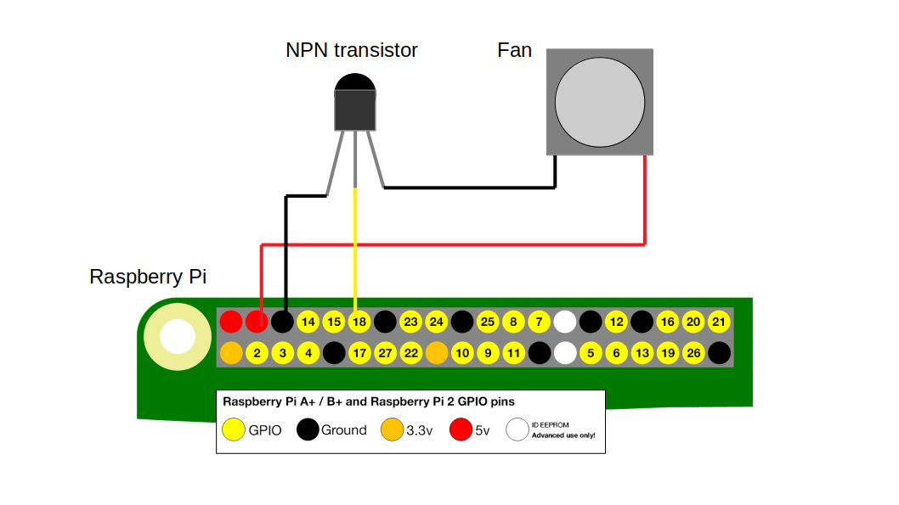

# RPi active cooling

## Description

Script that controls Raspberry Pi fan depending on the GPU temperature measurement. 

Tested on Raspberry Pi 4B with Raspbian installed but it should work on any Raspberry with VideoCore GPU

Requires **vcgencmd** and **gpio** (**wiringPi** utility) to be available on the system (should be already installed on Raspbian)

Note: Make sure that user running the script is in the *video* group to be able to execute **vcgencmd** and *gpio* group to be able to control GPIO pins without sudo

    sudo usermod -aG video,gpio {username}

## Installation

    npm install -g rpi-active-cooling

## Usage

    rpiac {gpio} {min} {max}

example

    rpiac 18 55 70

**gpio** - GPIO pin to control the fan (BCM ordering)

**max** - temperature ('C) above which fan is enabled

**min** - temperature ('C) below which fan is disabled

## Required electronic adjustments

If your fan does not have a built-in control wire you need to add a transistor switch to the ground wire to be able to control the fan programatically.

See the scheme below

## Running as a systemd service

Create a service unit file

    sudo nano /etc/systemd/system/rpiac.service

Paste content replacing user *pi* with your own

    Description=Raspberry Pi Active Cooling
    After=network.target
    [Service]
    ExecStart=rpiac 18 55 70
    User=pi
    [Install]
    WantedBy=multi-user.target

Then enable and start service

    sudo systemctl enable rpiac
    sudo systemctl start rpiac

## Known issues

Make sure you have the latest wiringPi, otherwise GPIO control might not work on Raspberry Pi 4B

http://wiringpi.com/wiringpi-updated-to-2-52-for-the-raspberry-pi-4b/